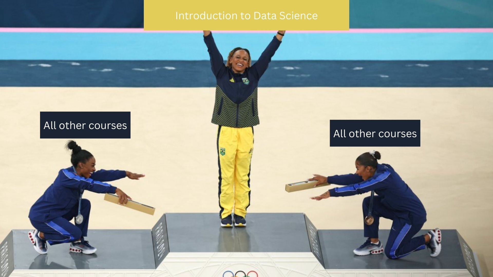

```{r install-package, include = FALSE, eval = FALSE}
# Copy and paste the following code into your console to download and install
# the `xaringan` package that contains all of the code which allows you 
# to create presentation slides in Rmarkdown
install.packages('xaringan')
```


```{r load-packages, include = FALSE}
# Add any additional packages you need to this chunk
library(tidyverse)
library(tidymodels)
library(palmerpenguins)
library(knitr)
library(xaringanthemer)
library(readr)
library(dplyr)
library(janitor)
library(patchwork)
```

```{r setup, include=FALSE}
# For better figure resolution

knitr::opts_chunk$set(fig.retina = 3, dpi = 300, fig.width = 6, fig.asp = 0.618, out.width = "80%")
```

```{r load-data, include=FALSE}
olympics <- read_csv("data/olympics.csv", show_col_types = FALSE)
olympic_medals <- olympics %>% 
  filter(!is.na(medal)) %>%
  mutate(
   host_country = case_when(
     city == "Albertville" ~ "FRA",
     city == "Amsterdam" ~ "NED",
     city == "Antwerpen" ~ "BEL",
     city == "Athina" ~ "GRE",
     city == "Atlanta" ~ "USA", 
     city == "Barcelona" ~ "ESP",
     city == "Beijing" ~ "CHN",
     city == "Berlin" ~ "GER",
     city == "Calgary" ~ "CAN",
     city == "Chamonix" ~ "FRA",
     city == "Cortina d'Ampezzo" ~ "ITA",
     city == "Garmisch-Partenkirchen" ~ "GER",
     city == "Grenoble" ~ "FRA",
     city == "Helsinki" ~ "FIN",
     city == "Innsbruck" ~ "AUT",
     city == "Lake Placid" ~ "USA",
     city == "Lillehammer" ~ "NOR",
     city == "London" ~ "GBR",
     city == "Los Angeles" ~ "USA",
     city == "Melbourne" ~ "AUS",
     city == "Mexico City" ~ "MEX",
     city == "Montreal" ~ "CAN",
     city == "Moskva" ~ "RUS",
     city == "Munich" ~ "GER",
     city == "Nagano" ~ "JPN",
     city == "Oslo" ~ "NOR",
     city == "Paris" ~ "FRA",
     city == "Rio de Janeiro" ~ "BRA",
     city == "Roma" ~ "ITA",
     city == "Salt Lake City" ~ "USA",
     city == "Sankt Moritz" ~ "SUI",
     city == "Sapporo" ~ "JPN",
     city == "Sarajevo" ~ "BIH",
     city == "Seoul" ~ "KOR",
     city == "Sochi" ~ "RUS",
     city == "Squaw Valley" ~ "USA",
     city == "St. Louis" ~ "USA",
     city == "Stockholm" ~ "SWE",
     city == "Sydney" ~ "AUS",
     city == "Tokyo" ~ "JPN",
     city == "Torino" ~ "ITA",
     city == "Vancouver" ~ "CAN"
     )) 

# All predictors
predictors <- c("year", "num_athletes", "medals_before", "is_host", "avg_age", "avg_height", "avg_weight")

# Compute all subsets of a set excluding the empty one
powerset <- function(set) {
  n <- length(set)
  subsets <- unlist(lapply(1:n, function(k) combn(set, k, simplify = FALSE)), recursive = FALSE)
  
  subsets <- subsets[sapply(subsets, length) > 0]
  
  return(subsets)
}


all_subsets <- powerset(predictors)

# Function to fit the model on a single subset and return adjusted R-squared and MAE
fit_model_for_subset <- function(subset, train_data, test_data) {
  # Check if the subset is empty
  if (length(subset) == 0) {
    return("Empty set of predictors not allowed") 
  }
  
  # Create formula dynamically from the subset
  formula <- as.formula(paste("total_medals ~", paste(subset, collapse = " + ")))
  
  # Define the recipe for preprocessing
  recipe_sub <- recipe(formula, data = train_data) %>%
    step_dummy(all_nominal()) %>%   # Create dummy variables for factors
    step_normalize(all_numeric_predictors())  # Normalise numeric predictors
  
  # Define the linear regression model
  model <- linear_reg() %>%
    set_engine("lm")
  
  # Create the workflow
  workflow_sub <- workflow() %>%
    add_recipe(recipe_sub) %>%
    add_model(model)
  
  # Fit the model
  fit_sub <- fit(workflow_sub, data = train_data)
  
  pred_sub <- predict(fit_sub, test_data) %>%
    bind_cols(test_data) %>%
    mutate(.pred = round(.pred)) %>%
    mutate(.pred = if_else(.pred < 0, 0, .pred))
  
  # Extract adjusted R-squared and MAE
  fit_summary <- glance(fit_sub)
  adj_r_squared <- fit_summary$adj.r.squared
  mae_value <- mae(pred_sub, truth = total_medals, estimate = .pred)$.estimate
  
  # Return both MAE and adjusted R-squared as a named list
  return(list(mae = mae_value, adj_r_squared = adj_r_squared))
}

evaluate_all_subsets <- function(all_subsets, train_data, test_data) {
  # Initialize an empty list to store results
  results <- list()
  
  # Loop through all subsets
  for (subset in all_subsets) {
    if (length(subset) == 0) {
      # Skip empty subsets
      next
    }
    
    # Fit the model and extract metrics
    metrics <- fit_model_for_subset(subset, train_data, test_data)
    
    # Store the subset, MAE, and adjusted R-squared in the results
    results[[length(results) + 1]] <- list(
      subset = paste(subset, collapse = ", "),
      mae = metrics$mae,
      adj_r_squared = metrics$adj_r_squared
    )
  }
  
  # Convert the list to a data frame
  results_df <- do.call(rbind, lapply(results, as.data.frame))
  
  # Convert MAE and adjusted R-squared to numeric 
  results_df$mae <- as.numeric(results_df$mae)
  results_df$adj_r_squared <- as.numeric(results_df$adj_r_squared)
  
  # Arrange by ascending MAE
  results_df <- results_df[order(results_df$mae), ]
  
  # Return the sorted results
  return(results_df)
}

```

```{r include=FALSE}

#Background image
style_xaringan(
  title_slide_background_image = "img/olympics new.jpeg"
)
```

class: center, middle

## Can we predict the number of medals won by a team at the Olympics? What factors can we use?

---

class: inverse, center, middle

# A brief overview of the data

---

# Initial exploration

- We explored the data set that includes basic bio data on athletes and medal results from Athens 1896 to Rio 2016

-- 

- Here's what we saw:

--

- The top 5 countries with the most Olympians were: USA, France, Great Britain, Italy, and Germany

--

- The biggest contingents by sports were: USA (Athletics), USA (Swimming), Australia (Swimming), USA (Basketball), Canada (Ice Hockey)

--

- The top 5 countries with the most medals were: United States, Soviet Union, Germany, Australia, Russia (can see how the data itself is slightly problematic here)

--

- Roughly 4.9% (15% total) of athletes win a gold, silver or bronze medal each. 85% of the athletes at the Olympics have not won medals

---
# What we did
```{r, echo=FALSE}
# Prepare data
medals_summer <- olympic_medals %>%
  filter(season == "Summer") %>%
  group_by(year) %>%  # Group by year
  mutate(
    age = ifelse(is.na(age), mean(age, na.rm = TRUE), age),
    weight = ifelse(is.na(weight), mean(weight, na.rm = TRUE), weight),
    height = ifelse(is.na(height), mean(height, na.rm = TRUE), height)
  ) %>%
  ungroup() %>%
  group_by(year, noc) %>% # Group by year and team (country)
  summarise(
    season = first(season),
    total_medals = n(), # Total medals won
    num_athletes = n_distinct(id), # Number of unique athletes
    avg_age = mean(age), # Average age of athletes
    avg_height = mean(height), # Average height
    avg_weight = mean(weight), # Average weight
    is_host = if_else(any(noc == host_country), 1, 0), # Check if NOC is the host
    .groups = 'drop'
  ) %>%
  arrange(year) %>% # Arrange by year for cumulative calculation
  group_by(noc) %>%
  mutate(
    medals_before = cumsum(total_medals) - total_medals) %>%
  ungroup() %>%
  mutate(is_host = as.factor(is_host))

# Prepare data
medals_winter <- olympic_medals %>%
  filter(season == "Winter") %>%
  group_by(year) %>%  # Group by year
  mutate(
    age = ifelse(is.na(age), mean(age, na.rm = TRUE), age),
    weight = ifelse(is.na(weight), mean(weight, na.rm = TRUE), weight),
    height = ifelse(is.na(height), mean(height, na.rm = TRUE), height)
  ) %>%
  ungroup() %>%
  group_by(year, noc) %>% # Group by year and team (country)
  summarise(
    season = first(season),
    total_medals = n(), # Total medals won
    num_athletes = n_distinct(id), # Number of unique athletes
    avg_age = mean(age), # Average age of athletes
    avg_height = mean(height), # Average height
    avg_weight = mean(weight), # Average weight
    is_host = if_else(any(noc == host_country), 1, 0), # Check if NOC is the host
    .groups = 'drop'
  ) %>%
  arrange(year) %>% # Arrange by year for cumulative calculation
  group_by(noc) %>%
  mutate(
    medals_before = cumsum(total_medals) - total_medals) %>%
  ungroup() %>%
  mutate(is_host = as.factor(is_host))
```

- We split the data into Winter and Summer and identified 7 predictors 

--

- These were- average age, average height, average weight, previous medals, number of athletes, year of the Olympics and if they were the host country.

---

# Why?

```{r, echo = FALSE}
all_medals <- suppressMessages(full_join(medals_summer, medals_winter))


all_medals %>%
  group_by(year, season) %>%
  summarise(total_medals_per_year = sum(total_medals), .groups = "drop") %>%  
  ggplot(mapping = aes(x = year, y = total_medals_per_year, colour = season)) +  #
  geom_point() +  
  geom_smooth(method = "lm", formula = y ~ x, se = FALSE, aes(group = season)) +  
  labs(title = "Total Medals Won Each Year",
       subtitle = "by Season",
       x = "Year",
       y = "Total Medals") +
  theme_minimal() +  # Apply minimal theme for clarity
  theme(axis.text.x = element_text(angle = 45, hjust = 1))
```
---
# Why?
```{r, echo = FALSE}
all_medals %>%
  group_by(year, season) %>%
  summarise(mean_h = mean(avg_height), .groups = "drop") %>%  
  ggplot(mapping = aes(x = year, y = mean_h, colour = season)) +  #
  geom_point() +  
  labs(title = "Average Height of Athletes Each year",
       subtitle = "by Season",
       x = "Year",
       y = "Average Height") +
  theme_minimal() +  # Apply minimal theme for clarity
  theme(axis.text.x = element_text(angle = 45, hjust = 1))
```
---
# Why?
```{r, echo = FALSE}
all_medals %>%
  filter(medals_before > 700) %>%
  ggplot(mapping = aes(x=medals_before, y = total_medals)) +
  geom_point() + 
  labs(title = "Medals Won at Games vs Medals Won Before the Games",
       subtitle = "for Countries with More Than 700 Medals Prior to Games",
       x = "Medals Won Before the Games",
       y = "Medals Won at Games") +
  theme_minimal()
```
---

# Summer Olympics

```{r, echo = FALSE}
# Split data into training and testing sets
medals_summer_new <- medals_summer %>%
  filter(year!="2016")
set.seed(1114)
split_summer <- initial_split(medals_summer_new, prop = 0.8)
train_summer <- training(split_summer)
test_summer <- testing(split_summer)

model <- linear_reg() %>%
  set_engine("lm")


recipe_s1 <- recipe(total_medals ~ num_athletes + medals_before + avg_age + avg_height + avg_weight + year + is_host,
                    data = train_summer) %>%
  step_dummy(all_nominal()) %>%
  step_normalize(all_numeric_predictors())


workflow_s1 <- workflow() %>%
  add_recipe(recipe_s1) %>%
  add_model(model)

fit_s1 <- fit(workflow_s1, data = train_summer)


pred_s1 <- predict(fit_s1, test_summer) %>%
  bind_cols(test_summer) %>%
  mutate(.pred = round(.pred)) %>%
  mutate(.pred = if_else(.pred < 0, 0, .pred))

```
``` {r, echo = FALSE}


tidy(fit_s1)
glance(fit_s1)
```

---
# Testing the model  (all predictors)
```{r, echo = FALSE}
ggplot(pred_s1, aes(x = total_medals, y = .pred)) +
  geom_point(color = "blue") +
  geom_abline(slope = 1, intercept = 0, color = "red", linetype = "dashed") +
  labs(
    title = "Actual vs Predicted Total Medals",
    x = "Actual Medals",
    y = "Predicted Medals"
  ) +
  theme_minimal()

```
---
# Model performance (metrics)
``` {r, echo = FALSE}
rmse(pred_s1, truth = total_medals, estimate = .pred)
mae(pred_s1, truth = total_medals, estimate = .pred)


```
---
# Summer Olympics (new and improved?)
```{r, echo = FALSE}
model <- linear_reg() %>%
  set_engine("lm")


recipe_s2 <- recipe(total_medals ~  num_athletes + medals_before + avg_height + is_host,
                    data = train_summer) %>%
  step_dummy(all_nominal()) %>%
  step_normalize(all_numeric_predictors())


workflow_s2 <- workflow() %>%
  add_recipe(recipe_s2) %>%
  add_model(model)

fit_s2 <- fit(workflow_s2, data = train_summer)

tidy(fit_s2)
glance(fit_s2)


pred_s2 <- predict(fit_s2, test_summer) %>%
  bind_cols(test_summer) %>%
  mutate(.pred = round(.pred)) %>%
  mutate(.pred = if_else(.pred < 0, 0, .pred))
```
---
# Testing the model (fewer predictors)
```{r, echo = FALSE}
ggplot(pred_s2, aes(x = total_medals, y = .pred)) +
  geom_point(color = "blue") +
  geom_abline(slope = 1, intercept = 0, color = "red", linetype = "dashed") +
  labs(
    title = "Actual vs Predicted Total Medals",
    x = "Actual Medals",
    y = "Predicted Medals"
  ) +
  theme_minimal()
```
---
# Model Performance (Metrics)
```{r, echo = FALSE}
rmse(pred_s2, truth = total_medals, estimate = .pred)
mae(pred_s2, truth = total_medals, estimate = .pred)
```
---
# Testing both models on Rio 2016
```{r two-plots, fig.align='center', echo = FALSE}

summer_2016 <- medals_summer %>%
  filter(year == "2016")

pred_2016_1 <- predict(fit_s1, summer_2016) %>%
  bind_cols(summer_2016) %>%
  mutate(.pred = round(.pred)) %>%
  mutate(.pred = if_else(.pred < 0, 0, .pred)) %>%     
  select(noc, total_medals, .pred) %>%          
  arrange(desc(total_medals)) %>%
  mutate(pct_error = ((abs(total_medals - .pred))/total_medals) * 100)

pred_2016_2 <- predict(fit_s2, summer_2016) %>%
  bind_cols(summer_2016) %>%
  mutate(.pred = round(.pred)) %>%
  mutate(.pred = if_else(.pred < 0, 0, .pred)) %>%     
  select(noc, total_medals, .pred) %>%          
  arrange(desc(total_medals)) %>%
  mutate(pct_error = ((abs(total_medals - .pred))/total_medals) * 100)

# Create two plots
model1_plot <- pred_2016_1 %>%
  ggplot(mapping = aes(x = .pred, y = total_medals)) +
  geom_point() +
  geom_abline(slope = 1, intercept = 0, color = "red", linetype = "dashed") +
  labs(
    title = "Actual vs Predicted Total Medals",
    x = "Actual Medals",
    y = "Predicted Medals"
  ) +
  ggtitle("Model 1")+
  theme_minimal()
model2_plot <- pred_2016_2 %>%
  ggplot(mapping = aes(x = .pred, y = total_medals)) +
  geom_point() +
  geom_abline(slope = 1, intercept = 0, color = "red", linetype = "dashed") +
  labs(
    title = "Actual vs Predicted Total Medals",
    x = "Actual Medals",
    y = "Predicted Medals"
  ) +
  ggtitle("Model 2")+
  theme_minimal()

# Combine plots side by side
(model1_plot + model2_plot) +
  plot_layout(widths = c(1, 1), heights = c(0.8)) &  # Adjust sizes
  theme(plot.margin = margin(10, 20, 10, 20))  # Add margin for spacing

```
---
# Findings
- Our main finding was that the largest errors emerge when there are few medals (for both models)

--

- In the second model, 
  - For teams with more than 25 medals, the average error is 6.8%.
  - The MAE is 1.8, which is 7.8% of the mean (23.5) and we think that is a reasonable fit.
  
---
# Winter Olympics
```{r, echo = FALSE}
# Split data into training and testing sets
medals_winter_new <- medals_winter %>%
  filter(year!="2014")
set.seed(1114)
split_winter <- initial_split(medals_winter_new, prop = 0.8)
train_winter <- training(split_winter)
test_winter <- testing(split_winter)

model <- linear_reg() %>%
  set_engine("lm")


recipe_w1 <- recipe(total_medals ~ num_athletes + medals_before + avg_age + avg_height + avg_weight + year + is_host,
                    data = train_winter) %>%
  step_dummy(all_nominal()) %>%
  step_normalize(all_numeric_predictors())


workflow_w1 <- workflow() %>%
  add_recipe(recipe_w1) %>%
  add_model(model)

fit_w1 <- fit(workflow_w1, data = train_winter)

tidy(fit_w1)
glance(fit_w1)
```
---
# Testing the model (all predictors)
```{r, echo = FALSE}
pred_w1 <- predict(fit_w1, test_winter) %>%
  bind_cols(test_winter) %>%
  mutate(.pred = round(.pred)) %>%
  mutate(.pred = if_else(.pred < 0, 0, .pred))

ggplot(pred_w1, aes(x = total_medals, y = .pred)) +
  geom_point(color = "blue") +
  geom_abline(slope = 1, intercept = 0, color = "red", linetype = "dashed") +
  labs(
    title = "Actual vs Predicted Total Medals",
    x = "Actual Medals",
    y = "Predicted Medals"
  ) +
  theme_minimal()
```
---
# Model performance (Metrics)
```{r, echo = FALSE}

rmse(pred_w1, truth = total_medals, estimate = .pred)
mae(pred_w1, truth = total_medals, estimate = .pred)
```
---
# Again, could it be made better?
```{r, echo = FALSE}
model <- linear_reg() %>%
  set_engine("lm")


recipe_w2 <- recipe(total_medals ~ num_athletes + avg_weight + year + medals_before,
                    data = train_winter) %>%
  step_dummy(all_nominal()) %>%
  step_normalize(all_numeric_predictors())


workflow_w2 <- workflow() %>%
  add_recipe(recipe_w2) %>%
  add_model(model)

fit_w2 <- fit(workflow_w2, data = train_winter)

tidy(fit_w2)
glance(fit_w2)
```
---
# Testing the model (fewer predictors)
```{r, echo = FALSE}
pred_w2 <- predict(fit_w2, test_winter) %>%
  bind_cols(test_winter) %>%
  mutate(.pred = round(.pred)) %>%
  mutate(.pred = if_else(.pred < 0, 0, .pred))

ggplot(pred_w2, aes(x = total_medals, y = .pred)) +
  geom_point(color = "blue") +
  geom_abline(slope = 1, intercept = 0, color = "red", linetype = "dashed") +
  labs(
    title = "Actual vs Predicted Total Medals",
    x = "Actual Medals",
    y = "Predicted Medals"
  ) +
  theme_minimal()
```
---
# Model performance (metrics)
```{r, echo = FALSE}
rmse(pred_w2, truth = total_medals, estimate = .pred)
mae(pred_w2, truth = total_medals, estimate = .pred)
```
---
# Testing both models on Sochi 2014
``` {r, echo = FALSE}
winter_2014 <- medals_winter %>%
  filter(year == "2014")

pred_2014_1 <- predict(fit_w2, winter_2014) %>%
  bind_cols(winter_2014) %>%
  mutate(.pred = round(.pred)) %>%
  mutate(.pred = if_else(.pred < 0, 0, .pred)) %>%     
  select(noc, total_medals, .pred) %>%          
  arrange(desc(total_medals)) %>%
  mutate(pct_error = ((abs(total_medals - .pred))/total_medals) * 100)

pred_2014_2 <- predict(fit_w2, winter_2014) %>%
  bind_cols(winter_2014) %>%
  mutate(.pred = round(.pred)) %>%
  mutate(.pred = if_else(.pred < 0, 0, .pred)) %>%     
  select(noc, total_medals, .pred) %>%          
  arrange(desc(total_medals)) %>%
  mutate(pct_error = ((abs(total_medals - .pred))/total_medals) * 100)


# Create two plots
model1_plot <- pred_2014_1 %>%
  ggplot(mapping = aes(x = .pred, y = total_medals)) +
  geom_point() +
  geom_abline(slope = 1, intercept = 0, color = "red", linetype = "dashed") +
  labs(
    title = "Actual vs Predicted Total Medals",
    x = "Actual Medals",
    y = "Predicted Medals"
  ) +
  ggtitle("Model 1")+
  theme_minimal()
model2_plot <- pred_2014_2 %>%
  ggplot(mapping = aes(x = .pred, y = total_medals)) +
  geom_point() +
  geom_abline(slope = 1, intercept = 0, color = "red", linetype = "dashed") +
  labs(
    title = "Actual vs Predicted Total Medals",
    x = "Actual Medals",
    y = "Predicted Medals"
  ) +
  ggtitle("Model 2")+
  theme_minimal()

# Combine plots side by side
(model1_plot + model2_plot) +
  plot_layout(widths = c(1, 1), heights = c(0.8)) &  # Adjust sizes
  theme(plot.margin = margin(10, 20, 10, 20))  # Add margin for spacing
```
---
# Findings
- Like the Summer Olympics, bigger differences when predicted number of medals is low.

- Both models have no particularly big, noticeable differences and will give similar values.

--- 

# Conclusions
- Number of athletes, as expected, is present in all models with rmse = 3 (1 s.f). It does impact the likelihood of winning a medal
- number of athletes, as expected, is present in all models with MAE = 2 to 1 sf
* models without num_athletes have MAE of at least 18 for Summer and 7 for Winter Olympics
- There is less data for Winter Olympics (started in 1924) which leads to less accurate predictions
- There is a lot of missing data for early Games in general, some values (age, height, weight) have been substituted for average values for that year and season
- There are issues tracking medals won before for countries like Soviet Union, Czechoslovakia, East/West Germany
---

class: center
# THANK YOU

```{r castle, echo = FALSE, out.width = "55%", fig.align = "center", fig.cap = "Image credit: Photo by Elsa on Getty Images"}

```
---
